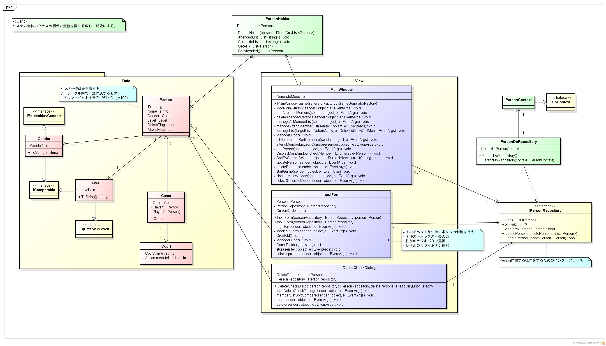

# コート分けアプリ詳細設計書

* ## 目次
    * [データベース](#database)

    * [クラス図](#class_diagram)

    * [シーケンス図](#sequence_diagram)

---

* ## データベース
 
    * データベースの保存場所  
    ユーザー フォルダ
        \> AppData フォルダ
            \> Local フォルダ
                \> forest フォルダ

    * データベースのフレームワーク  
    SQLite(Version 3.22.0)  

    * データベースのドライバ  
    EntityFrameworkCore(Version 2.0.2)  

---

* ## クラス図  

    * ### メンバーを追加・変更・削除する
        

    * ### アルゴリズムの変更機能・試合の組み合わせを決める
        .png)

---

* ## シーケンス図  
    * ### 起動する
        
    * 練習参加メンバーの選択・取りやめ
        
    * 練習試合を行う
        
        
