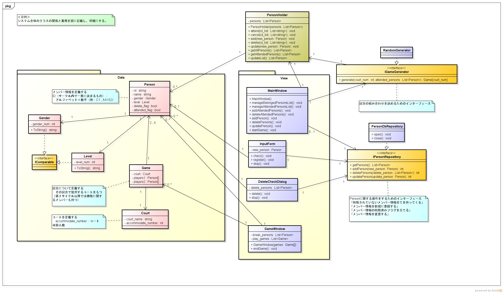
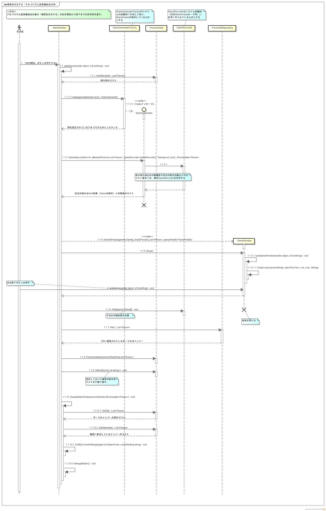

# コート分けアプリ詳細設計書

* ## 目次
    * [目次](#index)

    * [データベース](#database)

    * [クラス図](#class_diagram)

    * [シーケンス図](#sequence_diagram)

---

* ## データベース
 
    * データベースの保存場所  
    ローカルディスク(C:)  
    \> ユーザー フォルダ  
    \> AppData フォルダ  
    \> Local フォルダ  
    \> forest フォルダ  

    * 使用するデータベースのフレームワーク  
    PostgreSQL  

---

* ## クラス図  

---

* ## シーケンス図  

